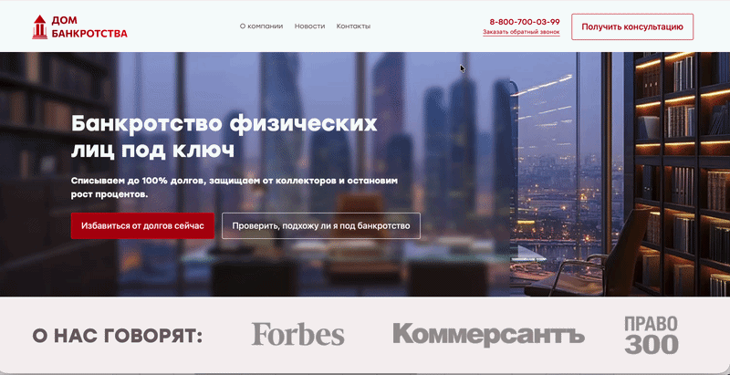

# Dom Bankrotstva

A responsive business website for a bankruptcy assistance service.
The platform provides information about bankruptcy procedures, consultation options, and allows users to contact the company through interactive forms.

Live Demo:
https://dom-bankrotstva.vercel.app

## Screenshots




---

## Features

* Responsive landing pages
* Service information sections
* Contact and consultation forms
* SEO-friendly structure
* Optimized page performance
* Clean and accessible UI

---

## Tech Stack

Frontend

* React
* TypeScript
* Vite

Styling

* CSS
* Responsive layout

Forms

* Client-side validation

Deployment

* Vercel

---

## Screenshots

Add screenshots of the interface here.

Examples:

* Main landing page
* Service sections
* Contact form
* Mobile layout

---

## Installation

Clone the repository

```bash id="v2x8fl"
git clone https://github.com/romatimanov/dom-bankrotstva.git
```

Go to project directory

```bash id="m8jflp"
cd dom-bankrotstva
```

Install dependencies

```bash id="r6p41k"
npm install
```

Start development server

```bash id="p81jvf"
npm run dev
```

---

## Project Structure

```id="sxw0jp"
src
 ├── components
 ├── pages
 ├── sections
 ├── assets
 ├── styles
 └── utils
```

---

## Performance

The project focuses on:

* fast loading speed
* optimized assets
* responsive layout across devices

---

## Deployment

The application is deployed on **Vercel**.

Live version:
https://dom-bankrotstva.vercel.app

---

## Author

Roman Deshevitsyn

GitHub
https://github.com/romatimanov

LinkedIn
https://linkedin.com/in/roman-deshevitsyn-1272612b9
